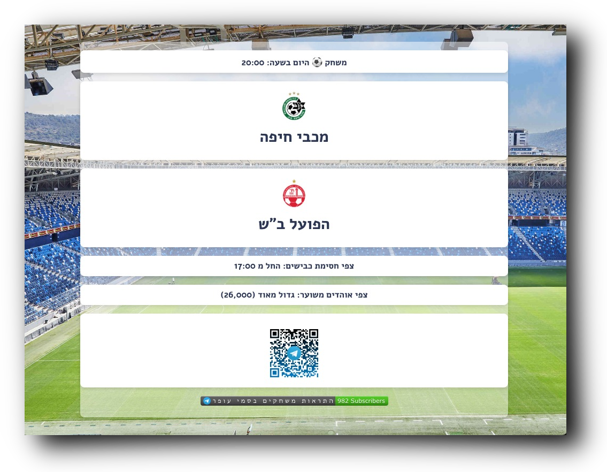
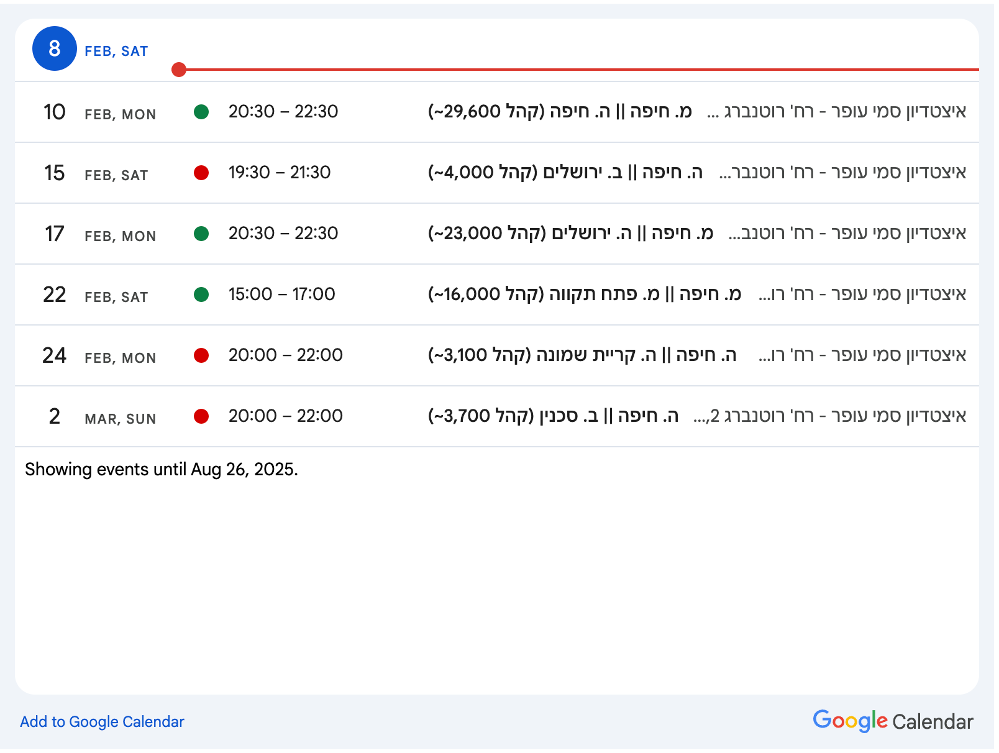

# Sammy Ofer Notification Bot 🤖

[](https://www.buymeacoffee.com/drehelis)
[](https://t.me/sammy_ofer_notification_channel)
[](https://yeshmishak.top/cal.html)

## Description

A small time scheduled (cron) _web-scraper_ to notify of upcoming game events taking place in [Sammy Ofer Stadium](https://www.haifa-stadium.com/ "Sammy Ofer Stadium").

Join the notification #channel on [Telegram](https://t.me/sammy_ofer_notification_channel) and enjoy:

* ☝️ Single notification for the upcoming event
* 🚦 Matchup, average attendance and roadblock times
* ⛔ Spam free service
* 🌎 Static landing page to be shown on big screen/TV
* 🗓️ Public Google Calendar

## Web-UI


## Static landing page ([link](https://drehelis.github.io/sammy_ofer/static.html))



## Google Calendar



## Build it
```
git clone https://github.com/autogun/sammy_ofer.git
cd sammy_ofer
docker build . -t sammy_ofer
```

## Run it
```
cat << EOF > .env
TELEGRAM_CHANNEL_ID=<required>
TELEGRAM_TOKEN=<required>
GH_PAT=(optional)
SKIP_COMMIT=false
SKIP_CALENDAR=false
EOF

docker run -d --name sammy_ofer \
    --publish 5000:5000 \
    --restart=on-failure \
    --env-file ./.env \
    --volume $(PWD)/service_account.json:/usr/src/sammy_ofer/service_account.json \
    --volume $(PWD)/sammy_ofer.db:/usr/src/sammy_ofer/sammy_ofer.db \
    sammy_ofer:latest
```

## Debug
```
uv pip install -r requirements.txt
flask run --debug --port=5001
```

Manually run cron job
```
python -c "from scheduler import run_job; run_job()"
```

## TODO
I'm out of ideas...

- [x] ~~Use SQLite instead of a dictionary file~~
- [x] ~~**Delete** option currently does absolutely nothing~~
- [x] ~~Cron configuation (some sort of UI?)~~
